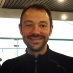
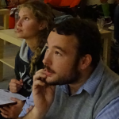
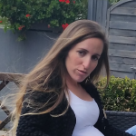

L'association G.Squash a vu le jour le _15 mai 2014_.

Cette association initialement basée au Squash Club de Gières, et a vu par le passé quelques démenagement, est basée maintenant au Break Sportif d'Echirolles.

## Activités de l'association

_G.Squash est double champion départementale, titre remis en jeu cette saison !_

Toute l'association ainsi que le club vous accueillera au Break Sportif d'Echirolles pour plusieurs animations et pour vous faire partager sa passion pour le Squash.

Voici maintenant une présentation des activités de l'association :

## Activités de l'association

Championnat annuel loisirs (G2SLigue)

Tout au long de la saison, tous les membres de l'association se confrontent pour remporter la G2SLigue !

Toutes les informations ici.

### Championnat annuel loisirs "G2S Ligue"

Tout au long de la saison, tous les membres de l'association se confrontent pour remporter la G.Ligue !

N'hésitez pas a regarder le [reglement]( "reglement")

## Soirée squash / Tournoi loisirs

Ponctuellement des soirées squash sont organisées afin de se retrouver dans un climat de joyeuserie et d'humour avec des formules permettant de rencontrer un grand nombre de personnes autour de "formules squash" différentes selon l'organisateur.

Quelques tournois loisirs seront organisés lors de la saison 2020/2021.

Une annonce sera faite lors de l'ouverture des inscriptions.

## Compétition

L'association donne accès à la compétition à celles et ceux qui désirent se frotter au gratin régional et national.

Il est possible de participer à des *tournois individuels* (référencés à la Fédération Française de Squash), mais également de participer aux *championnat régionaux de la ligue Rhone-Alpes-Auvergne par équipes*.

Lors de cette saison 2020/2021, 23 équipes sont inscrites

- [GIERES 0 en Régionale 2 féminine]( "Gieres 0")

- [GIERES 1 en Régionale 2 masculine]( "Gieres 1")

- [GIERES 2 en Régionale 3 masculine]( "Gieres 2")

- [GIERES 3 en Départementale masculine]( "Gieres 3")

  _G.Squash est double champion départementale, une 3ieme pour cette année ?_

## Cordage

Le [service de cordage]( "Service Cordage") est toujours d'actualité : Merci de voir avec une personne de l'assoication ou directement avec Christophe Spinello pour réparer votre matériel ! (coût 25€)

## Bureau

| Président                          | Trésorier                             | Secretaire                     | Capitaine G1  | Capitaine G2     | Capitaine F1   |
|------------------------------------|---------------------------------------|--------------------------------|---------------|------------------|----------------|
| Gaëtan Pluton                      | Guillaume Gambs                       | Jenn Arabadjian-Steffen        | Laurent Braud | Arnaud Chauviere | Membre inconnu |
|  |  |  |               |                  |                |