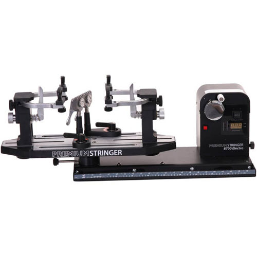
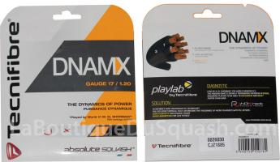

Service Cordage

L'association G.Squash propose un service de cordage de votre raquette de squash.

La machine utilisée est une STRINGER 8700 électronique.

IMAGE machine_cordage.jpg

Les cordages proposés sont :

*Tecnifibre DNAMX Gauge 1.20 (Noir)* :

Nouveau cordage sortie en Avril 2016, remplaçant du 305 plus dont il reprend les caractéristiques de jeu. Confort et durabilité. Un cordage qui ne demande aucun temps d'adaptation.

Prix : *15 euros*

Coût de la pose : *10 euros*

Délai de pose : 48 heures.

Envoyer un mail à contact@gsquash.fr pour spécifier la tension désirée. Merci de faire passer la raquette à un membre de l'association.
